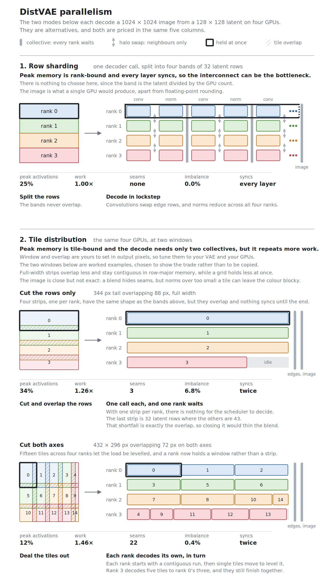

# Row sharding or tiling

Two ways to cut a decode down to size, and they cost different things:

Nothing in it is schematic. Every block is sized by the work in its tile, and [`make_figure.py`](make_figure.py) asks the scheduler itself which rank gets which tile. Every row closes on the same five numbers, measured the same way, so a column can be read straight down.

The lower two rows are one mode at two windows. Cutting only the rows lands on four full-width strips, one per rank, which is the same shape as the bands above them and so isolates what tiling changes: two collectives instead of a sync in every layer, paid for on all four of the other columns. Cutting both axes then takes what a rank holds down to about a third of that and levels the load. Each row's timeline is scaled to its own heaviest rank, so the lengths compare lanes within a row and not rows against each other. Across them the work column is the one to read, and it says what the imbalance column hides: the strips' critical path is about 8% shorter than the grid's despite the idle rank, because 1.26× coverage beats 1.46× by more than levelling the lanes wins back. Balancing a decode is not the same as shortening it.

The comparison to hold on to is still the one the two headings make: the tile shrinks whenever you narrow the window, while the band shrinks only with the GPU count.

Both marks in the legend name something missing. A halo is an input row a convolution does not have; a tile edge is a decoded pixel a blend does not have.

**Row sharding** splits one decoder call across the group, so its collectives scale with the depth of the decoder and nothing you can set changes that. What it splits is the activations. Every rank still runs the whole decoder, so per-rank memory falls with the GPU count only down to the weights.

**Tiling** splits the latent instead, which is why it is the one that lowers peak memory on a single GPU. Whether narrowing the window lowers it further depends on what a tile holds. Where a tile is one decoder call over everything in it, as on the 2D VAEs and on HunyuanVideo, halving the window takes better than half the memory off. Where the frames inside a tile are decoded one at a time, as on Wan and Qwen-Image, most of what a rank holds is elsewhere, so narrowing the tile costs time and saves nothing. Part of the fidelity cost cannot be tuned away: overlap fixes the seam, but nothing fixes a group norm taken over one tile, so a window narrow enough to starve those statistics shades the whole tile and more overlap will not repair it.

## Whole tiles rather than rows inside them

DistVAE deals whole tiles out across ranks rather than sharding the rows of each tile in turn. Sharding inside the loop makes every tile pay for its own patchify, halo exchanges and gather, so that cost grows with the tile count exactly as each rank's share of the arithmetic shrinks, and past some number of tiles extra ranks stop helping. Tiles are independent in a way the rows inside one are not, so dealing them out costs two exchanges for the whole decode however many tiles there are, and leaves each rank decoding its tile the way one GPU would.

What that costs is granularity. A tile cannot be split, so the decode waits for whichever rank holds the most. Tiles are dealt by area rather than counted, because the grid's last row and column are clipped and so are cheap, and a rank can hold five of them where its neighbour holds three while doing much the same work. That gets the figure's fifteen tiles within half a percent of an even split. No dealing fixes an indivisible remainder, though, and the fewer the tiles the more it costs: nine tiles over four GPUs leaves someone decoding three against an average of 2.25. With fewer tiles than ranks the dispatch gives up altogether and every rank decodes all of them, so choose a window that yields at least a tile per GPU. Row sharding splits rows instead, a fine enough unit that the remainder rarely matters, though it still needs a row per rank.

Which is faster is not obvious. Tiling does more arithmetic, row sharding does more round trips, and a deep decoder on small tensors can lose more to the round trips than tiling loses to its overlap. Peak memory is the clearer call. `bench/` measures latency, memory, collectives, and agreement for each VAE, resolution, and GPU count; the [benchmark guide](../bench/README.md) defines the cases.

## Why the window is rectangular

The figure's tiling header says that window was chosen to balance peak memory, redundant work and seams. Optimising those on a square latent produces a rectangle. A 432 × 296 window cuts the 128 × 128 into three rows of five, and it beats the 384 × 384 square the latent's shape suggests on every count at once: 12.2% of the activations held against 14.1%, 1.46× the work against 1.47×, half a percent past an even split against 15.1%, and twenty-two seams against twenty-four. Both take the same 72 pixels of overlap on each axis, so the shape of the window really is the only difference between them.

The imbalance is where the gap is widest, and clipping is what opens it. A corner tile is clipped on both axes at once, so a symmetric grid clips it symmetrically: the square ends on an 11 × 11 tile worth a nineteenth of a full one, and dealing by area cannot make a rank's share come out even around something that small. The rectangle's corner is still worth a third of a full tile, which leaves the scheduler something to balance with.

Against the other extreme, the one the figure draws, it is a trade rather than a clean win. Full-width strips do less work, leave three seams instead of twenty-two, and sit better in memory, since a strip is one unbroken span of a row-major tensor where a grid's tile is a stride through every row it touches. What they cost is memory: a rank holds 34% of the activations against 12%, and the rank handed the clipped strip sits out a quarter of the decode. The rectangle is the better answer to peak memory, which is what tiling is usually for, and it is not the better answer to everything. That is why the window is a control rather than a default.

The two axes are worth setting apart even for a square image, because the overlap is paid once per axis that is cut and the bounds clip whichever axis does not divide evenly. Neither of those depends on the latent being square.

[Choosing a tile window](tiling.md) works through what follows from that.

## Video

Neither strategy splits frames. Row sharding refuses the frame axis and tiling has no temporal seam to blend, so the figure describes the video case too: every band and every tile carries all the frames it was handed, and what a rank holds is its share of the latent multiplied by them. Where the 3D VAEs chunk frames at all they do it above the spatial loop, in diffusers' own, which calls the spatial loop once per chunk and behaves the same each time. Inside a tile, Wan and Qwen-Image decode the frames one at a time to thread a causal cache through them, so a tile there is a run of small calls rather than one large one.
